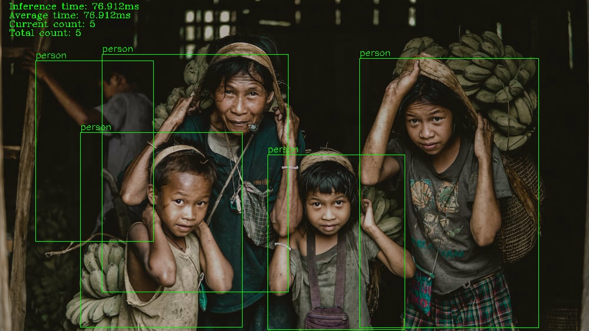
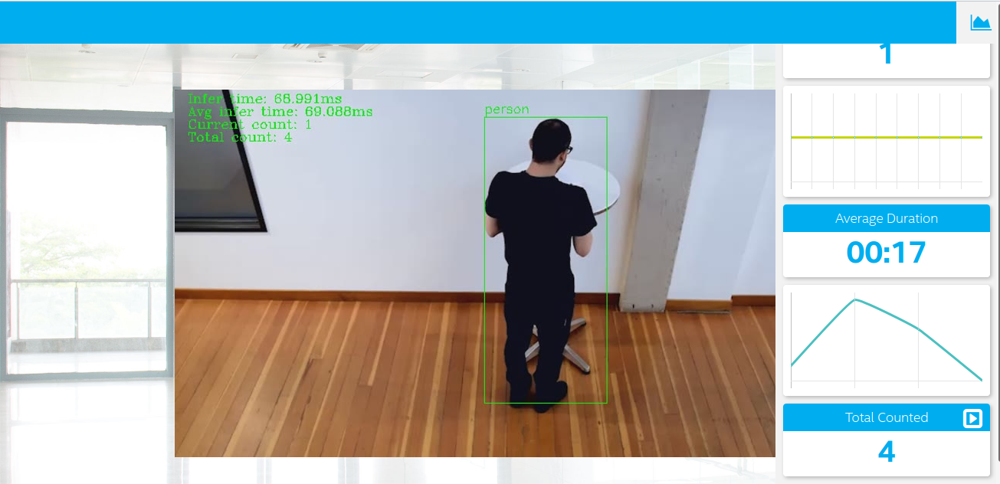

# Project Write-Up

The goal of this project is to implement a people counter application in the egde using Intel OpenVino Toolkit, the application counts the number of people in each frame in real time, the duration they spent and the total number of people that passed from the monitored area.

Below an example of the result in a signle image



Below an example of the result of the application using a video as input



## Explaining Custom Layers

As known that OpenVino does not support converting layers of all types, in this case alternative solution could be considred in order to convert a model to a valid Inermediate Representation and benefit from the speed offred by using the edge computing. 


The Inference Engine loads the layers from the input model IR files into the specified device plugin, which will search a list of known layer implementations for the device. If the topology contains layers that are not in the list of known layers for the device, the Inference Engine considers the layer to be unsupported and reports an error. 

For this application I opted using a Custom Layer CPU Extension provided by intel, the extension could be found in `/opt/intel/openvino/deployment_tools/inference_engine/lib/intel64/libcpu_extension_sse4.so`


## Comparing Model Performance

My method to compare models before and after conversion to Intermediate Representations
were to implement the script `performance/main.py` which uses the Tensorflow saved model, and I defined the intervals for frames with true detections in the given video so I could compare the accuracy and record the duration of inference. In order to assess the tensorflow model, I configured a new virtual environment under `performance/perf_bench` to avoid dependency issues.

The performance assessement script of the Tensorflow model could be run using the followinf command wich takes the video and the probability threshold as arguments:

```
python3 ../resources/Pedestrian_Detect_2_1_1.mp4 0.2
```

Performenace assessments recorded under Udacity workspace, the characteristics of the machine were:

Architecture:          x86_64

CPU op-mode(s):        32-bit, 64-bit

Byte Order:            Little Endian

CPU family:            6

Model name:            Intel(R) Xeon(R) CPU @ 2.30GHz


The difference between model accuracy per probability threshold pre- and post-conversion was:


| Details            |     0.2       |   0.3     |  0.4       |  0.5       |
|--------------------|---------------|-----------|------------|------------|
|TF model            |     0.937     |   0.937   |  0.859     |  0.777     |
|IR FP32             |     0.931     |   0.931   |  0.845     |  0.775     |
|IR FP16             |     0.927     |   0.927   |  0.843     |  0.775     |


The size of the model pre- and post-conversion was

| Details            |  Before          | After    |
|-----------------------|---------------|----------|
| SSD Mobilenet v2 FP32| 67MB  |  65.1 MB    | 
| SSD Mobilenet v2 FP16| 67MB  |  33.1 MB    | 
| Faster RCNN Inception Resnet v2| 236MB  |  229.3MB|
| YOLO V3| 237MB  |  237.1MB|


The inference time of the model  per probability threshold pre- and post-conversion was:


| Details            |     0.2       |   0.3     |  0.4       |  0.5       |
|--------------------|---------------|-----------|------------|------------|
|TF model            |    143.800ms  | 144.151ms | 143.564ms  |  115.706ms |
|IR FP32             |     68.712ms  |  69.063ms |  68.846ms  |  68.594ms  |
|IR FP16             |     67.667ms  |  69.688ms |  69.960ms  |  69.459ms  |


## Assess Model Use Cases

Some of the potential use cases of the people counter app are:

* Keeping track of people that visits a certain store or any place, and count them and the duration they spend, which could be used for intrusion detection.

* Regulate a queue in order to keep just a certain number of people present in a given area and for a given duration, and this without opting for any human help.

* The application also could be used to collect statistics about people that visit a certain place including their gender and age, which will help to know their customers and target them by providing the suited products for them.

* This system is also could be very useful for a modern classroom to keep track of the presence of the students. 

* The application could be used in public places like airports specially if the application provides a recognition of people, which could be expoited to determine if a certain person were in a given place, when and how much time, this will be very usefull to manage in some special cases like monitoring the spread of COVID-19.  


## Assess Effects on End User Needs

Lighting, model accuracy, and camera focal length/image size have different effects on a
deployed edge model. The potential effects of each of these are as follows:


Lighting could dramatically affect the accuracy of the model in case the camera placed in a place with less or more light which will affect the results communicated to the application, so in order to make sure that the application functions as expected deployment should take in consideration placing the camera in the good position to ensure a good lighting.

The model accuracy is very important and it's the core of these kind of applications, without an acceptable accuracy the application will lead to an unpredecitble results, an option to avoid this is by using some computer vision techniques to ignore some wrong detections, also training your own model may lead to a better accuracy which is another option that could be considred. 


The detection of the model could be also affected by the camera focal, as the content of the frames captured will depend on distance between the camera and the objects detected, so the model should be trained to take care of all of these cases. the camera should be placed to cover all of the monitoring area to get the wanted accuracy and avoid missing people that passes throught.


## Model Research

For the implementation of the project, I opted for a list of objects detection models to convert into an Intermediate Representation including: SSD MobileNet V2 COCO, Faster RCNN Inception Resnet V2 COCO and YOLO V3, the most who worked for me was SSD MobileNet V2 COCO:

**SSD MobileNet V2 COCO conversion**:

Model link: [SSD MobileNet V2 COCO](http://download.tensorflow.org/models/object_detection/ssd_mobilenet_v2_coco_2018_03_29.tar.gz)

```
python3 /opt/intel/openvino/deployment_tools/model_optimizer/mo_tf.py --reverse_input_channels --input_model ssd_mobilenet_v2_coco_2018_03_29/frozen_inference_graph.pb --tensorflow_use_custom_operations_config /opt/intel/openvino/deployment_tools/model_optimizer/extensions/front/tf/ssd_v2_support.json --tensorflow_object_detection_api_pipeline_config ssd_mobilenet_v2_coco_2018_03_29/pipeline.config
```

SSD MobileNet V2 coco is the the model that worked most for me, even it presents some miss detections, but with lowering the probsbility thershold to 0.2 and implementing a mechanism to avoid miss counting the application works better.  


**Faster RCNN Inception Resnet V2 coco:**

Model link: [Faster RCNN Inception Resnet V2 COCO](http://download.tensorflow.org/models/object_detection/faster_rcnn_inception_resnet_v2_atrous_coco_2018_01_28.tar.gz)


```
python3 /opt/intel/openvino/deployment_tools/model_optimizer/mo_tf.py --reverse_input_channels --input_model faster_rcnn_inception_resnet_v2_atrous_coco_2018_01_28/frozen_inference_graph.pb --tensorflow_use_custom_operations_config /opt/intel/openvino/deployment_tools/model_optimizer/extensions/front/tf/ssd_v2_support.json --tensorflow_object_detection_api_pipeline_config faster_rcnn_inception_resnet_v2_atrous_coco_2018_01_28/pipeline.config
```

The Faster RCNN model have a better accuracy but with more big latency in inference, we use the edge for getting a better speed and in this case the speed is getting worse which makes this model not the best choice.   

**YOLO V3 conversion:**

1. Clone yolo v3 respository 
```
git clone https://github.com/mystic123/tensorflow-yolo-v3.git

cd tensorflow-yolo-v3
```
2. Checkout into the tested version
```
git checkout ed60b90
```


3. Download [coco.name](https://raw.githubusercontent.com/pjreddie/darknet/master/data/coco.names) and [YOLO V3 weights](https://pjreddie.com/media/files/yolov3.weights)

4. Run the converter:
```
python3 convert_weights_pb.py --class_names coco.names --data_format NHWC --weights_file yolov3.weights
```
5. Generate the IR format using:
```
python3 mo_tf.py --input_model yolo_v3/yolo_v3.pb --tensorflow_use_custom_operations_config /opt/intel/openvino/deployment_tools/model_optimizer/extensions/front/tf/yolo_v3.json --batch 1 --reverse_input_channels
```

The yolo v3 also runs with significant inference latency, further more the detections aren't that good.


### The Chosed Model:

As mesntionned above the best model beside the Intel one `person-detection-retail-0013` that worked best for my application considring accuracy and latency is SSD MobileNet V2 Coco with a threshold below `0.3`, the command line for running the application is:


```
python3 main.py -i resources/Pedestrian_Detect_2_1_1.mp4 -m intel/ssd_mobilenet_v2_coco/frozen_inference_graph.xml -l /opt/intel/openvino/deployment_tools/inference_engine/lib/intel64/libcpu_extension_sse4.so -d CPU -pt 0.2 | ffmpeg -v warning -f rawvideo -pixel_format bgr24 -video_size 768x432 -framerate 24 -i - http://0.0.0.0:3004/fac.ffm
```


## References:

https://colab.research.google.com/github/tensorflow/hub/blob/master/examples/colab/object_detection.ipynb#scrollTo=6cPY9Ou4sWs_


https://www.tensorflow.org/guide/saved_model


https://docs.openvinotoolkit.org/latest/_docs_HOWTO_Custom_Layers_Guide.html

https://docs.openvinotoolkit.org/2019_R3/_docs_MO_DG_prepare_model_convert_model_tf_specific_Convert_Object_Detection_API_Models.html


https://docs.openvinotoolkit.org/latest/_docs_MO_DG_prepare_model_convert_model_tf_specific_Convert_YOLO_From_Tensorflow.html